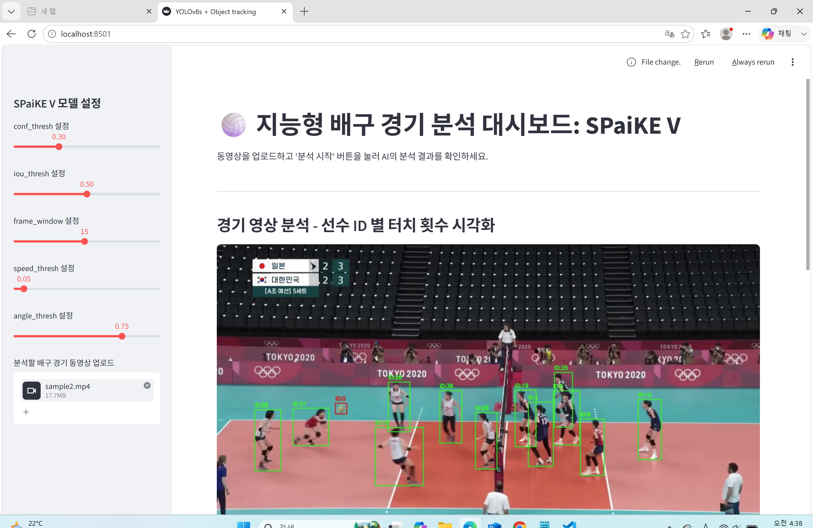

# SPaiKE_V



Advanced Computer Vision 01
AI 배구 경기 분석 대시보드 SPaiKE_V 입니다.
동영상(.mp4) 업로드 만으로 선수 별 경기 역량을 확인할 수 있습니다.

## ✨ 주요 기능
- 🏐 **배구공 Detection** - YOLOv8s 기반 배구공 detection 및 tracking
- 🤾 **배구선수 Tracking** - YOLOv8n 및 YOLOv8s 기반 배구선수 tracking
- 🖐️ **배구공 touch 판정** - tracking 결과를 이용해 선수 별 배구공 터치 횟수 시각화
- 📊 **Streamlit UI** - 사용자 파라미터를 조정하며 분석을 진행해볼 수 있는 User Interface

## 🖥️ 개발 환경 및 의존성
SPaiKE_V의 개발 환경은 다음과 같습니다.
- **운영체제** - Window11
- **개발언어** - Python(3.14.3)
- **가상환경** - venv
- **에디터** - VSCode

SPaiKE_V 사용을 위해 공통적으로 설치되어야 할 라이브러리는 다음과 같습니다.
```
altair==6.2.1
anyio==4.14.0
attrs==26.1.0
blinker==1.9.0
cachetools==7.1.4
certifi==2026.6.17
charset-normalizer==3.4.7
click==8.4.1
colorama==0.4.6
contourpy==1.3.3
cycler==0.12.1
filelock==3.29.4
fonttools==4.63.0
fsspec==2026.6.0
gitdb==4.0.12
GitPython==3.1.50
h11==0.16.0
httptools==0.8.0
idna==3.18
itsdangerous==2.2.0
Jinja2==3.1.6
jsonschema==4.26.0
jsonschema-specifications==2025.9.1
kiwisolver==1.5.0
lap==0.5.13
MarkupSafe==3.0.3
matplotlib==3.11.0
mpmath==1.3.0
narwhals==2.22.1
networkx==3.6.1
numpy==2.4.6
nvidia-ml-py==13.610.43
opencv-python==4.13.0.92
packaging==26.2
pandas==3.0.3
pillow==12.2.0
polars==1.41.2
polars-runtime-32==1.41.2
protobuf==7.35.1
psutil==7.2.2
pyarrow==24.0.0
pydeck==0.9.2
pyparsing==3.3.2
python-dateutil==2.9.0.post0
python-multipart==0.0.32
PyYAML==6.0.3
referencing==0.37.0
requests==2.34.2
rpds-py==2026.5.1
scipy==1.17.1
setuptools==81.0.0
six==1.17.0
smmap==5.0.3
starlette==1.3.1
streamlit==1.58.0
sympy==1.14.0
tenacity==9.1.4
toml==0.10.2
torch==2.12.1
torchvision==0.27.1
typing_extensions==4.15.0
tzdata==2026.2
ultralytics==8.4.71
ultralytics-thop==2.0.20
urllib3==2.7.0
uvicorn==0.49.0
watchdog==6.0.0
websockets==16.0
```

## 🔗 설치 방법
- 아래 커맨드를 통해 SPaiKE_V를 설치하실 수 있습니다.
```
git clone https://github.com/Jeon1731/SPaiKE_V.git 
```

- 현재 경로를 SPaiKE_V 폴더(디렉토리) 아래로 설정해주세요. 
- 라이브러리 설치를 위해 가상환경을 생성해주세요.
```
python -m venv .venv
```

- 가상환경을 실행해주세요.
- (VSCode: 기존 터미널을 닫고 새 터미널을 열면 가상환경이 자동으로 실행됩니다.)
```
# powershell
.venv/Scripts/Activate.ps1

# cmd
.venv/Scripts/activate.bat

# bash
source .venv/Scripts/activate
```

- 라이브러리를 설치해주세요.
```
pip install -r requirements.txt
```

- [models](https://drive.google.com/drive/folders/1pFLkkOCELB51fffNu_B3lenaOtwtsV8N?usp=drive_link)를 다운로드 받아 다음과 같이 위치해주세요.
```
../SPaiKE_V/models/ball_best.pt
../SPaiKE_V/models/player_best.pt
```

## 🏃실행 방법
- 아래 커맨드를 통해 SPaiKE_V를 실행해주세요.
```
streamlit run app.py
```
## 🌊 데이터 파이프라인
```
┌────────────────────────┐
│   동영상 업로드 (.mp4)  │
└────────────┬───────────┘
             │
             ▼
┌────────────────────────┐
│     모델 (.pt) 추론     │
└────────────┬───────────┘
             │
             ▼
┌───────────────────────────┐
│      트래킹 (txt 라벨)     │
└────────────┬──────────────┘
             │
             ▼
┌────────────┬──────────────┐
│   프레임   │  실시간 표    │
└────────────┬──────────────┘
             │
             ▼
┌────────────────────────┐
│    결과 막대 그래프     │
└────────────────────────┘
```

## 👥 팀원별 역할 분담
- ✨ Lee (20263007) - Ball Dataset PreProcessing & Augmentation, Ball Tracking (Frame-by-frame Detection, bytetrack), Stremlit UI
- 🫧 Jeon (20230887) - Player Dataset PreProcessing, Player Tracking(botsort, parameter custom), Streamlit UI